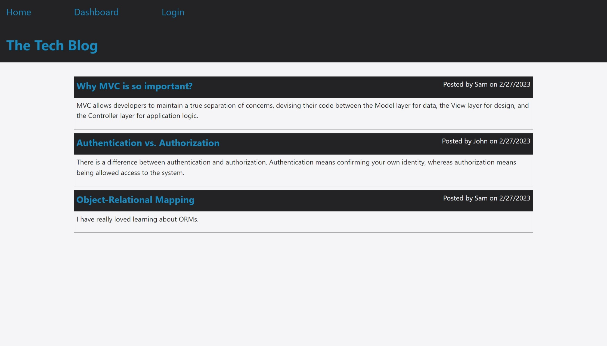
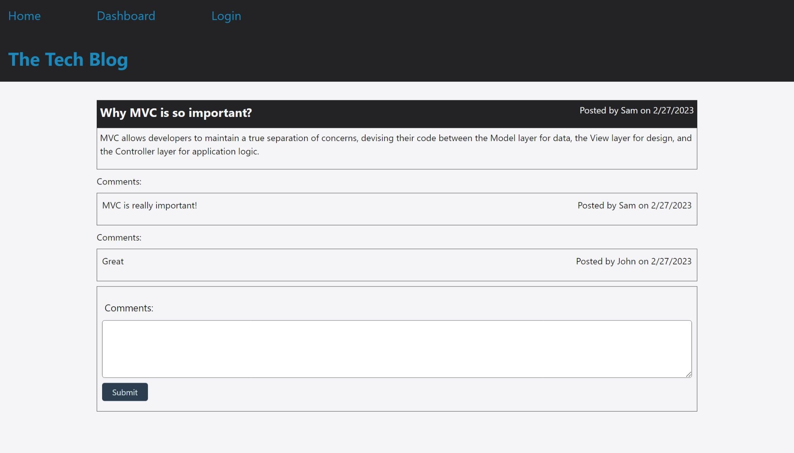
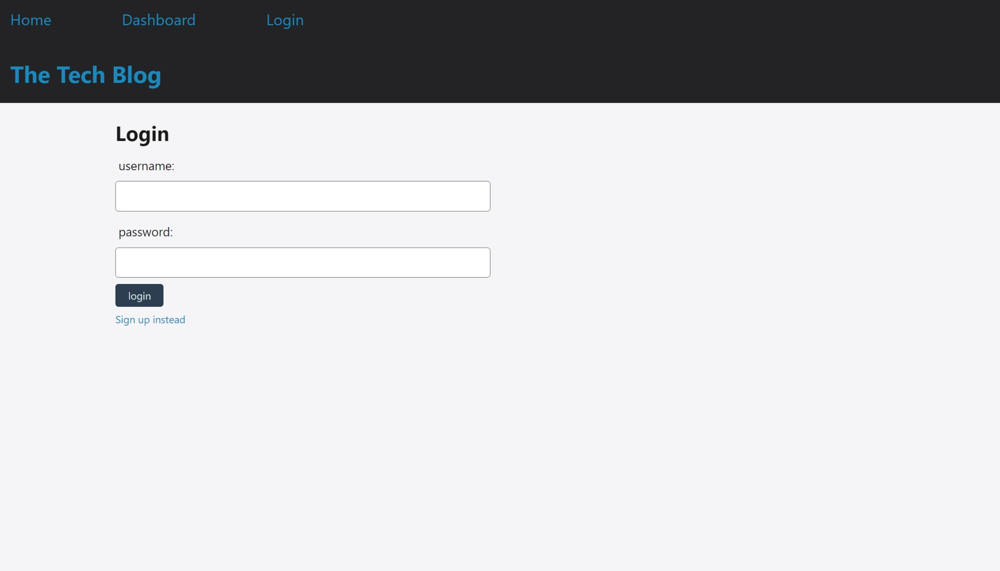
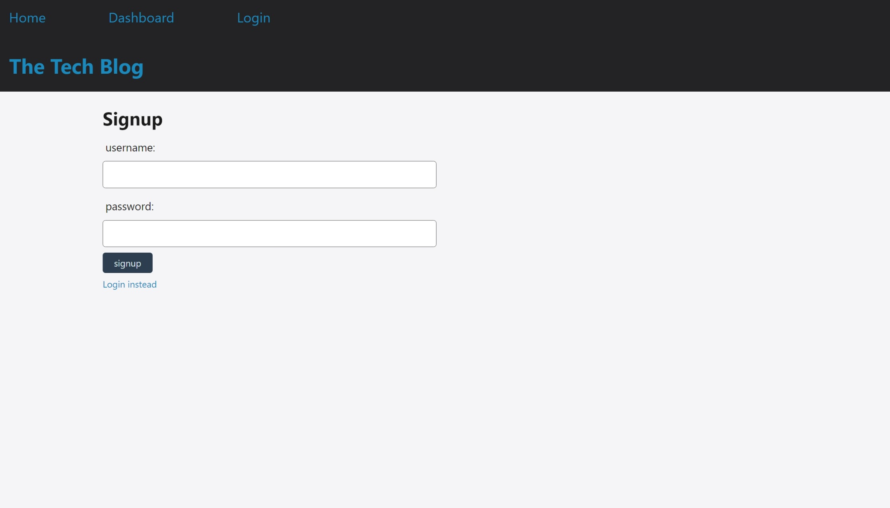
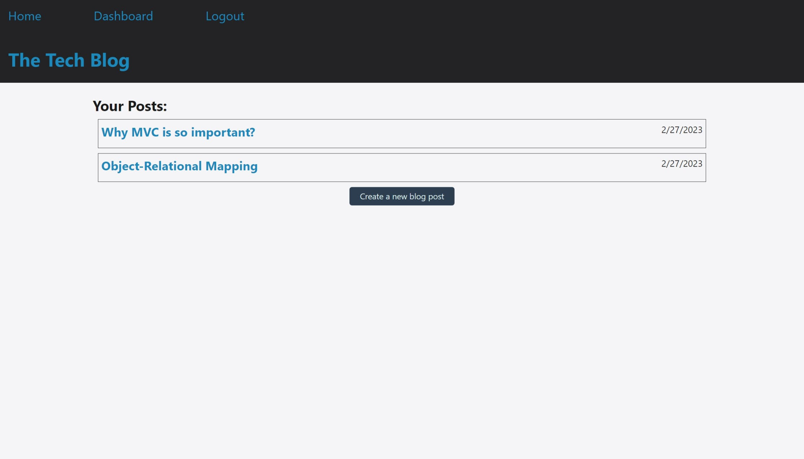
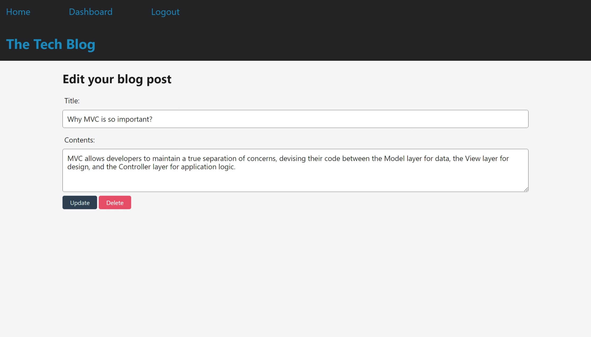
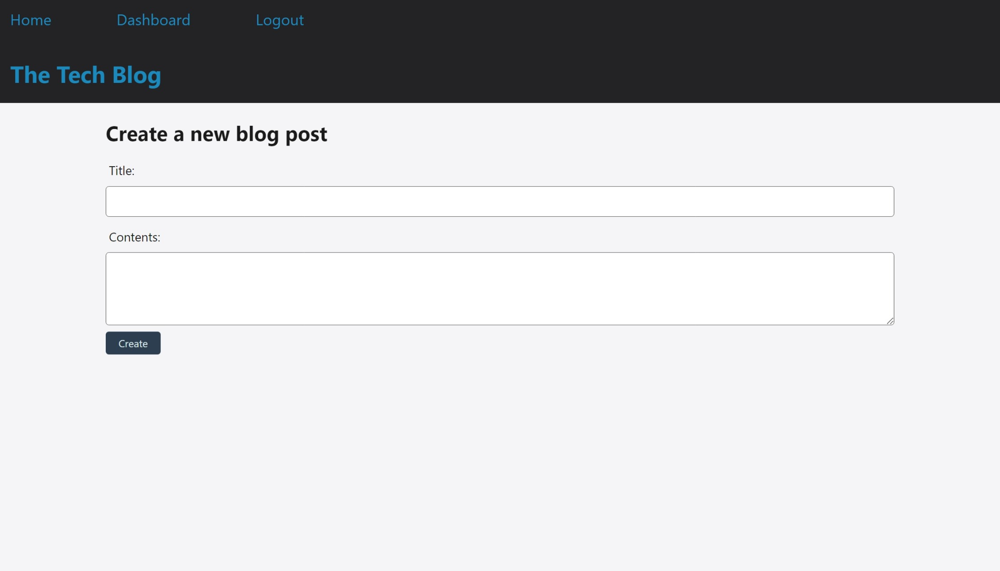

<!-- omit in toc -->
# Tech Blog

<!-- omit in toc -->
## Description

This is a CMS-style blog site where developers can publish their blog posts and comment on other developers' posts as well. This app follows the MVC paradigm in its architectural structure, using Handlebars.js ad the templating language, Sequelize as the ORM, and the express-session npm package for authentication.
<br/>

<!-- omit in toc -->
## Table of Contents
- [Installation](#installation)
- [Usage](#usage)
- [License](#license)

## Installation
- Install Node.js v16 and npm
- Install MySQL Server
- Install npm packages:
  ```
  npm install
  ```

## Usage
1. Enter your MySQL username and MySQL password in the `.env` file:
    ```yaml
    DB_NAME='tech_blog_db'
    DB_USER=''
    DB_PASSWORD=''
    ```
3. Create and select your database with MySQL shell commands:
    ```
    mysql -u root -p
    ```
    ```shell
    mysql> source db/schema.sql;
    mysql> quit;
    ```
4. Seed the test data to your database:
    ```
    npm run seed
    ```
5. Execute the app and run the server:
    ```
    npm start
    ```

- Index page

- Post detail page

- Login page

- Sign up page

- Dashboard page

- Edit post page

- Create post page

